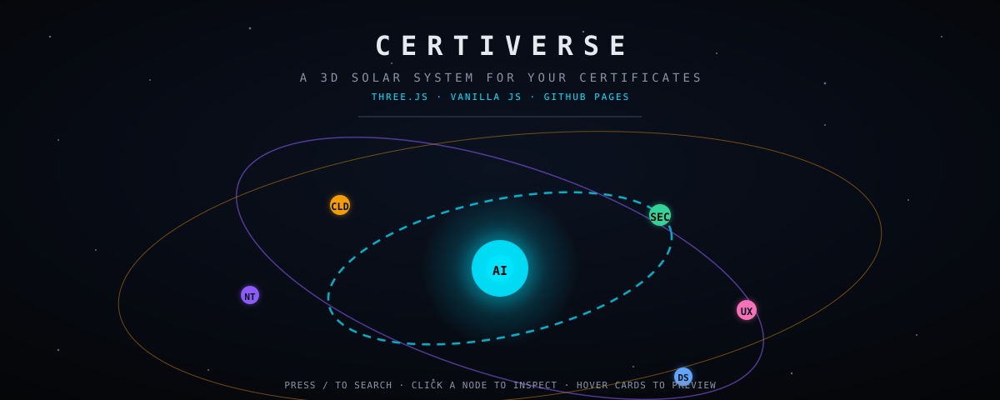

<p align="center">
  
</p>

<p align="center">
  <strong>your certificates, rendered as an interactive solar system.</strong><br/>
  every credential becomes an orbiting body. click a node to open its file.
</p>

<p align="center">
  <a href="https://adam-zs.github.io/certiverse/">
    
  </a>
</p>

<p align="center">
  
</p>

---

### `>_` mission log

```txt
> certiverse --boot
initializing three.js core .................... OK
calculating orbital mechanics (7 bodies) ....... OK
mapping categories to ring colors ............. OK
binding search, sort, filters ................. OK
rendering archive grid ........................ OK
SYSTEM ONLINE — click anywhere.
```

a single `data.js` array becomes a living constellation: the visuals, the filters, the orbit rings, the stats — all generated from your data. **no build step, no frameworks, no accounts.**

> [!NOTE]
> This is a **demo build** with fictional sample records. Fork it, drop in your own
> credentials, and ship your private archive in the time it takes to make a coffee.

---

### orbit rings

```
CYBERSECURITY  ● #00E5FF   ARTIFICIAL INTELLIGENCE ● #8B5CF6
PENETRATION TESTING  ●     DATA SCIENCE       ● #60A5FA
CLOUD          ● #F59E0B   NETWORKING        ● #F472B6
...every category you add gets an orbit ring and a filter chip.
```

each category is a **ring**, each credential a **node**, each person a **viewer**. hover to preview, click to focus, press `/` to search the whole system.

### flight features

| console | behavior |
|---|---|
| `SEARCH` | live text filter — `/` focuses the field |
| `FEATURED / NEWEST / OLDEST` | sort the archive like mission priorities |
| category chips | one click filters every card + highlights the ring |
| detail panel | fit-to-panel image (never cropped), readable dates, optional expiry, multi-badge categories, verify/open-PDF actions |
| verified badges | shown **only** when a real public verification URL exists — no fake claims |
| boot sequence | cinematic typewriter intro with a `SKIP` path |
| graceful fallback | full archive works even with WebGL disabled |

---

### how it works

```
        ┌─────────────┐        ┌───────────────┐        ┌──────────────────┐
        │  data.js    │        │   orbit core  │        │     archive      │
        │  your      ─┼───────▶│  three.js 3D  │───────▶│   search grid    │
        │  credentials│        │  ring + nodes │        │   + detail panel │
        └─────────────┘        └───────────────┘        └──────────────────┘
              ▲                                                     ▲
              └────────── one source of truth ──────────────────────┘
```

- `data.js` declares every credential.
- one normalize pass derives categories, stats, colors, and sorting.
- the same data drives the 3D core **and** the accessible grid below.

---

### quick start

```bash
git clone https://github.com/Adam-ZS/certiverse.git
cd certiverse
python3 -m http.server 8080     # then open http://localhost:8080
```

no dependencies, no build. or just open `index.html`.

### add your own credentials

edit **`data.js`** — a plain array of objects. put image/pdf files in `certs/` and reference them as `certs/my-cert.webp`.

```js
{
  id: "unique-slug",                    // required, unique
  name: "Credential Name",
  issuer: "Issuing Body",
  category: ["Category A", "Category B"],  // drives orbit rings + filters
  weight: 3,                            // 1–5 prominence
  featured: true,                       // renders large at the top
  dateObtained: "2025-03-02",           // ISO date or null
  description: "What this credential is.",
  certificateImage: "certs/slug.webp",        // or null → placeholder
  certificatePdf: "certs/slug.pdf",           // optional
  verificationUrl: "https://.../verify",      // real public link, or null
  verified: true                        // true ONLY if the URL verifies it
}
```

rules of engagement:

- `id`s must be unique.
- `dateObtained` is `YYYY-MM-DD` **or `null`** — never invent a day.
- `verified: true` implies a working public `verificationUrl`.
- missing images/dates surface as placeholders / `NOT RECORDED` — honest by design.

---

### license

MIT — fork it, bend it, orbit it around your own sun.

<p align="center">
  
</p>