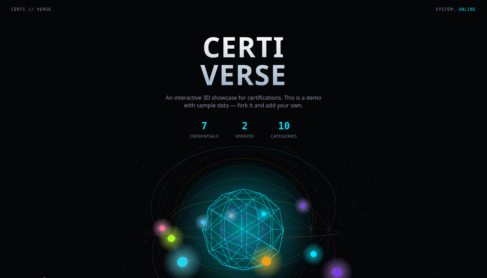

<h1 align="center">Certiverse</h1>

<p align="center">
  <a href="LICENSE"></a>
  <a href="CONTRIBUTING.md"></a>
</p>

<p align="center">
  
</p>

Your certifications as an interactive 3D solar system. Each credential is an orbiting node you can inspect, search, and filter.

**Live demo:** https://adam-zs.github.io/certiverse/



## Features

- 3D orbit with one ring per category — hover tooltips, click a node to filter
- Search (`/`), category chips, RESET, FEATURED / NEWEST / OLDEST sorting
- Detail panel: image, date, optional expiry, category badges, verify / open-PDF actions
- `VERIFIED` badge shown only when a real public verification URL exists
- Static HTML/CSS/JS, no build step — works on any host

## Quick start

```bash
git clone https://github.com/Adam-ZS/certiverse.git
cd certiverse
python3 -m http.server 8080
```

Open http://localhost:8080.

## Add your own credentials

Edit `data.js` — a plain array of objects. Put images/PDFs in `certs/`.

```js
{
  id: "unique-slug",
  name: "Credential Name",
  issuer: "Issuing Body",
  category: ["Category A", "Category B"],
  weight: 3,
  featured: true,
  dateObtained: "2025-03-02",   // ISO date, or null
  description: "What this credential is.",
  certificateImage: "certs/slug.webp",     // or null
  certificatePdf: "certs/slug.pdf",        // or null
  verificationUrl: "https://example.com/verify",  // or null
  verified: true                 // true only if verificationUrl verifies it
}
```

Rules:

- `id` must be unique.
- `dateObtained` is `YYYY-MM-DD` or `null` — don't invent a day.
- `verified: true` requires a working `verificationUrl`.

## License

MIT