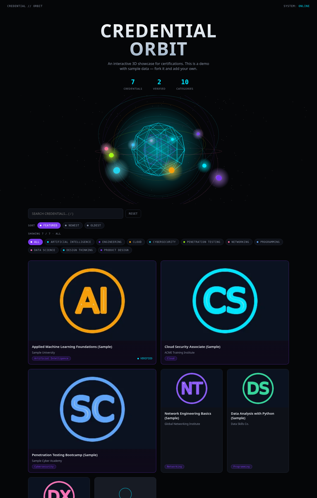

# Credential Orbit

An interactive, dark-mode credential showcase rendered as a 3D solar system — each certificate is an orbiting node. Click a node (or the archive grid below) to inspect details, verify links, images, and expiry dates.

> **Live demo:** https://adam-zs.github.io/credential-orbit/
>
> The demo ships with fictional sample data so you can see the UI in action without exposing anyone's credentials.



## Features

- Interactive Three.js 3D core — orbit rings per category, hover tooltips, click-to-filter
- Cinematic boot sequence with a skip button
- Search (press `/`), category filters, RESET, and FEATURED / NEWEST / OLDEST sorting
- Live result counter
- Detail modal: image (fit-to-panel, never cropped), readable dates, optional expiry, category badges, verification link, PDF viewer link
- Verified badges only when a real public verification link exists — no fake "verified" claims
- Graceful fallback: full grid archive works even without WebGL
- Social preview card (`og:image`) + favicon for rich link sharing

## Tech stack

- HTML / CSS / JavaScript (vanilla, no build step)
- Three.js r158 via jsDelivr
- GitHub Pages hosting (works on any static host: Netlify, Vercel, etc.)

## Quick start

```bash
git clone https://github.com/Adam-ZS/credential-orbit.git
cd credential-orbit
# serve locally
python3 -m http.server 8080   # then open http://localhost:8080
```

No build step. Just open `index.html` or serve the folder.

## Add your own credentials

Edit **`data.js`** — it's a plain array of objects. Drop image/PDF files into `certs/` and reference them like `certs/my-cert.webp`.

Schema per entry:

```js
{
  id: "unique-slug",                  // required, unique
  name: "Credential Name",
  issuer: "Issuing Body",
  category: ["Category A", "Category B"], // drives orbit rings + filters
  weight: 3,                          // 1–5, prominence (5 sorts highest)
  featured: true,                     // renders large at the top
  dateObtained: "2025-03-02",         // ISO date or null (shows "NOT RECORDED")
  description: "What this credential is.",
  certificateImage: "certs/slug.webp",      // or null -> placeholder
  certificatePdf: "certs/slug.pdf",         // optional, or null
  verificationUrl: "https://.../verify",    // real public link, or null
  verified: true                      // true ONLY if verificationUrl verifies it
}
```

Rules:

- Every `id` must be unique.
- `dateObtained` should be `YYYY-MM-DD` or `null` — never invent a day.
- Set `verified: true` only when `verificationUrl` actually verifies the credential.
- Missing images/dates surface as placeholders or "NOT RECORDED" — no fake data.

## License

MIT — do whatever you like. If it helps you, a star is appreciated.